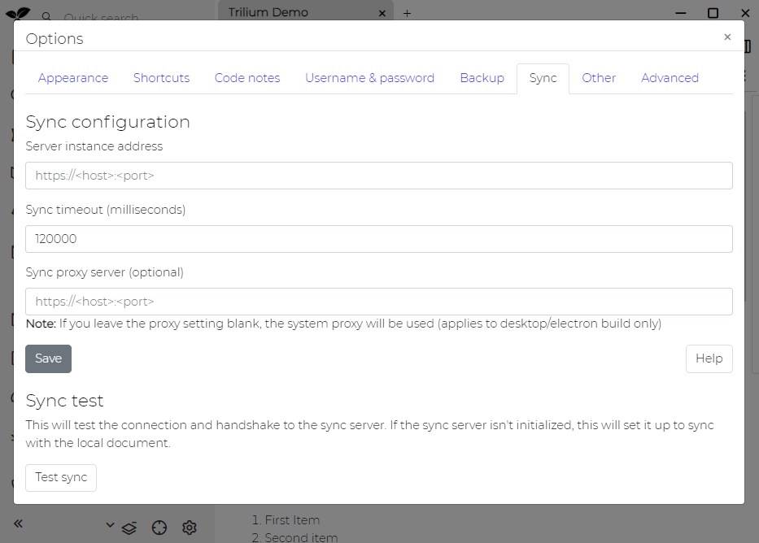

# Synchronization
Trilium is an offline-first note-taking application that stores all data locally on the desktop client. However, it also offers the option to set up synchronization with a server instance, allowing multiple desktop clients to sync with a central server. This creates a star-shaped topology:


In this setup, a central server (referred to as the _sync server_) and multiple _client_ (or _desktop_) instances synchronize with the sync server. Once configured, synchronization is automatic and ongoing, requiring no manual intervention.

## Setting Up Synchronization

### Security Considerations

Setting up the server securely is critical and can be complex. It is crucial to use a valid [TLS certificate](Server%20Installation/TLS%20Configuration.md) (HTTPS) rather than an unencrypted HTTP connection to ensure security and avoid potential vulnerabilities.

### Synchronizing a Desktop Instance with a Sync Server

This method is used when you already have a desktop instance of Trilium and want to set up a sync server on your web host.

1.  **Server Deployment**: Ensure your server instance is deployed but uninitialized.
2.  **Desktop Configuration**: Open your desktop instance, navigate to Options -> Sync tab -> Sync configuration, and set the "Server instance address" to your sync server's address. Click Save.



1.  **Testing Sync**: Click the "Test sync" button to verify the connection to the sync server. If successful, the client will start pushing all data to the server instance. This process may take some time, but you can continue using Trilium. Periodically check the server instance to confirm when the sync is complete. Once finished, you should see the login screen on the server.

### Synchronizing a Desktop Instance from a Sync Server

This method is used when you already have a sync server and want to configure a new desktop instance to sync with it.

1.  **Desktop Setup**: Follow the [desktop installation page](Desktop%20Installation.md).
2.  **Initial Configuration**: When prompted, choose the option to set up sync with a sync server.


1.  **Server Details**: Configure the Trilium server address and enter the correct username and password for authentication.
2.  **Finish Setup**: Click the "Finish setup" button. If successful, you will see the following screen:


Once synchronization is complete, you will be automatically redirected to the Trilium application.

## Proxy Configuration

Two proxy setups are supported:

*   **Explicit Proxy Configuration**: Set the proxy server in Options / Sync. Only unauthenticated proxy servers are supported.
*   **System Proxy Settings**: If no proxy server is explicitly configured, Trilium will use the system proxy settings.

## Troubleshooting

### Date/Time Synchronization

For successful synchronization, both client and server must have the same date and time, with a tolerance of up to five minutes.

### Certificate Issues

When using TLS, Trilium will verify the server certificate. If verification fails (e.g., due to self-signed certificates or certain corporate proxies), you can run the Trilium client with the `NODE_TLS_REJECT_UNAUTHORIZED` environment variable set to `0`:

```
export NODE_TLS_REJECT_UNAUTHORIZED=0
```

This will disable TLS certificate verification, significantly reducing security and exposing the setup to MITM attacks. It is strongly recommended to use a valid signed server certificate. Newer Trilium versions include a script called `trilium-no-cert-check.sh` for this purpose.

### Conflict Resolution

If you edit the same note on multiple instances before synchronization, Trilium resolves conflicts by retaining the newer change and discarding the older one. The older version remains accessible in [note revisions](../Basic%20Concepts%20and%20Features/Notes/Note%20Revisions.md), allowing data recovery if needed.

### Hash Check

After each synchronization, Trilium computes a hash of all synced data on both the client and the sync server. If there is a discrepancy, Trilium will automatically initiate a recovery mechanism to resolve the issue.