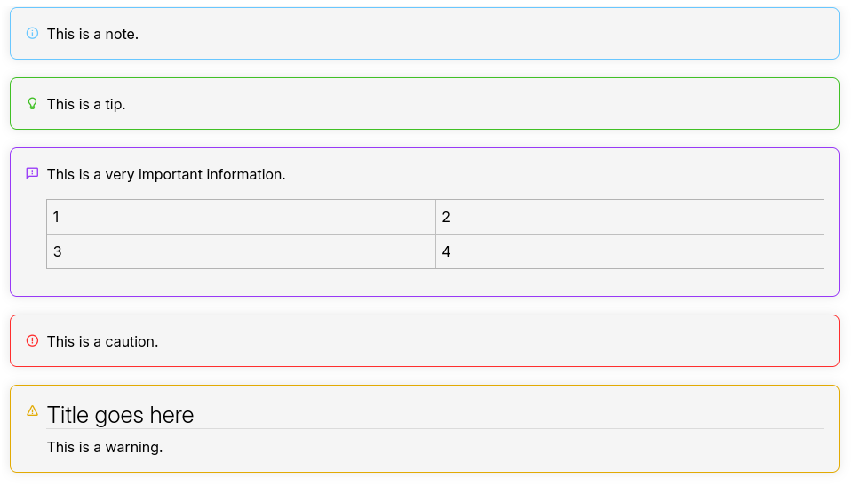
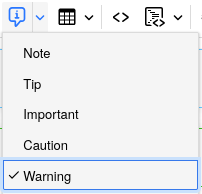

# Admonitions


Admonitions are a way to highlight information to the reader. Other names for it include _call-outs_ and _info/warning/alert boxes_.

## Inserting a new admonition

### From the UI

In the Formatting toolbar:



### Via the keyboard

It's possible to insert an admonition simply by typing:

*   `!!! note`
*   `!!! tip`
*   `!!! important`
*   `!!! caution`
*   `!!! warning`

In addition to that, it's also possible to type `!!!`  followed by any text, case in which a default admonition type will appear (note) with the entered text inside it.

## Interaction

By design, admonitions act very similar to block quotes.

*   Selecting a text and pressing the admonition button will turn that text into an admonition.
*   If selecting multiple admonitions, pressing the admonition button will automatically merge them into one.

Inside an admonition:

*   Pressing <kbd>Backspace</kbd> while the admonition is empty will remove it.
*   Pressing <kbd>Enter</kbd> will start a new paragraph. Pressing it twice will exit out of the admonition.
*   Headings and other block content including tables can be inserted inside the admonition.

## Types of admonitions

There are currently five types of admonitions: _Note_, _Tip_, _Important_, _Caution_, _Warning_.

These types were inspired by GitHub's support for this feature and there are currently no plans for adjusting it or allowing the user to customize them.

## Markdown support

The Markdown syntax for admonitions as supported by Trilium is the one that GitHub uses, which is as follows:

```markdown
> [!NOTE]
> This is a note.

> [!TIP]
> This is a tip.

> [!IMPORTANT]
> This is a very important information.

> [!CAUTION]
> This is a caution.
```

There are currently no plans of supporting alternative admonition syntaxes such as `!!! note`.